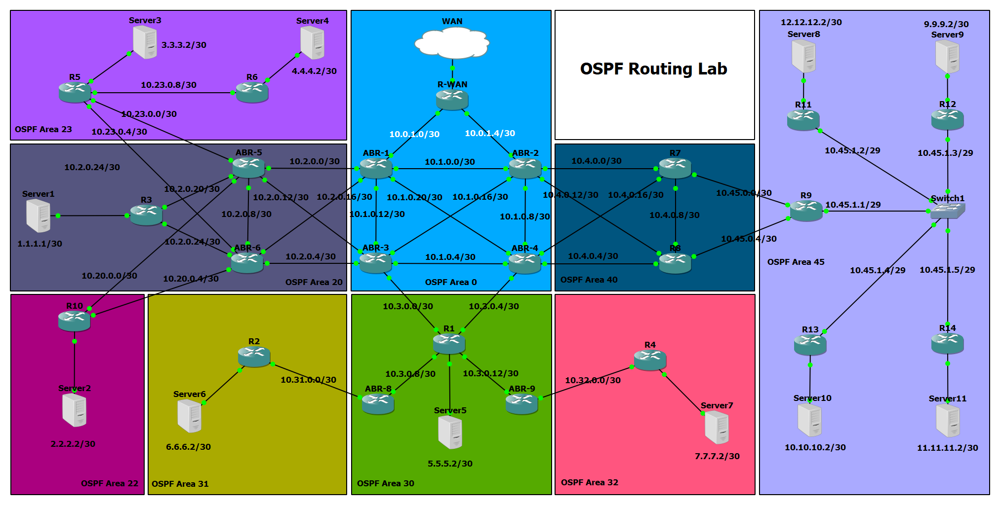
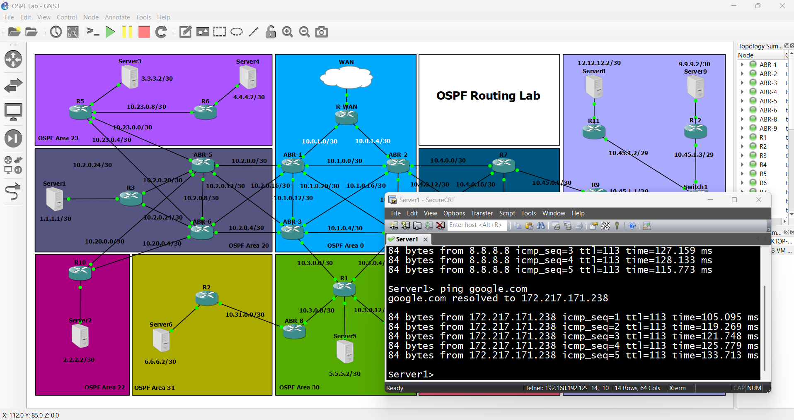
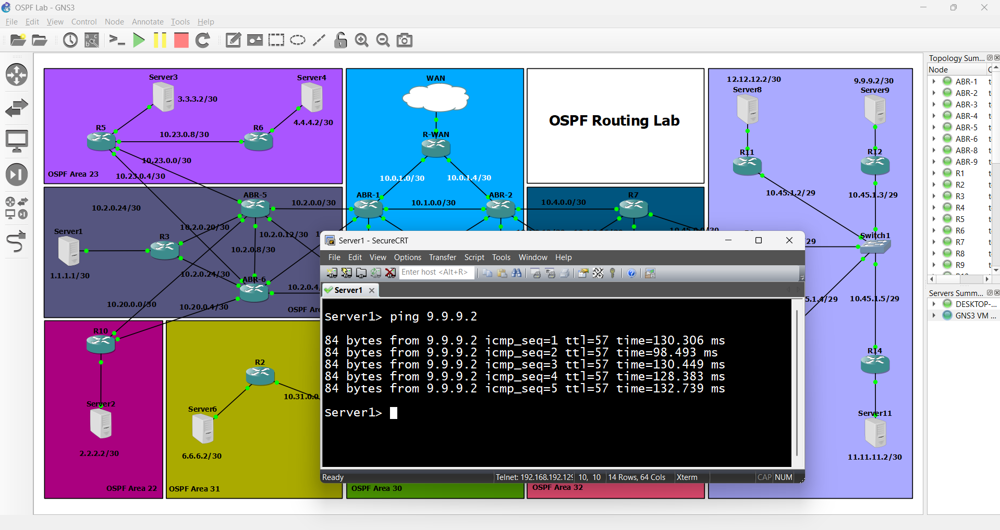
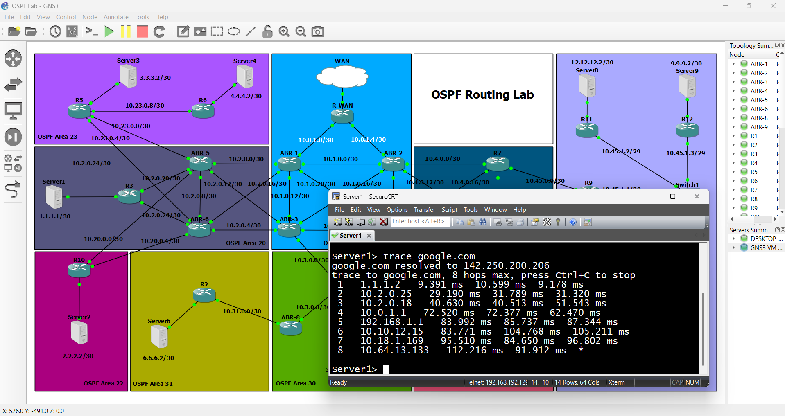

# 🛰️ OSPF Routing Lab



## Overview

This lab demonstrates a full OSPF routing environment consisting of multiple OSPF areas connected through ABRs. The objective is to show:

- OSPF Area design (Standard & NSSA)
- Inter-area communication
- Default route propagation
- NAT configuration for internet access
- PAT (Port Address Translation) implementation
- Virtual Link usage
- End-to-End connectivity test

---

## 🔧 Technologies Used

- Cisco IOS Routers (GNS3 or Packet Tracer)
- OSPF Protocol (Single AS)
- NAT/PAT
- ACL (Optional)
- IP Routing (Static & Dynamic)

---

## 📡 Topology Description

The topology contains:

- **9 OSPF Areas**:

  - Area 0 (Backbone)
  - Area 20, 22, 23, 30, 31, 32, 40, 45 (Standard / NSSA)

- **Routers**:

  - Core routers acting as ABRs and redistribution points
  - Edge routers managing NAT, PAT, and WAN access
  - All routers run the Cisco IOS image: `c7200-adventerprisek9-mz.124-24.T5`

- **Servers**:

  - Distributed in each area to test reachability and simulate services
  - Implemented using regular PCs in GNS3 to simulate servers
  - Verified with successful ping tests to ensure full connectivity

- **Internet (via R-WAN)**:

  - Connected through **R-WAN** router
  - Used to verify default route propagation and PAT configuration

- **Switch**:

  - Switch1 is used to aggregate devices in Area 45

---

## 🌐 Key Configurations

### OSPF Configuration Example

```bash
router ospf 1
 router-id 1.1.1.1
 network 10.1.0.0 0.0.0.255 area 0
```

### Default Route Injection

```bash
ip route 0.0.0.0 0.0.0.0 <next-hop/interface>
router ospf 1
 default-information originate
```

### NAT & PAT Example

```bash
interface Gig0/1
 ip nat outside
interface Gig0/0
 ip nat inside
ip nat inside source list 1 interface Gig0/1 overload
access-list 1 permit 10.0.0.0 0.255.255.255
```

### Virtual Link Example

```bash
! Router R1 - Router ID: 1.1.1.1
router ospf 1
 router-id 1.1.1.1
 area 20 virtual-link 2.2.2.2

! Router R2 - Router ID: 2.2.2.2
router ospf 1
 router-id 2.2.2.2
 area 20 virtual-link 1.1.1.1

```

---

## ✅ Testing

### Ping Test Example 1



### Ping Test Example 2



### Traceroute Test Example



---

## 🧠 What You Learn

- OSPF area types and summarization

- Virtual link use cases and configuration

- Inter-area route propagation

- NAT/PAT behavior and configuration

- Best practices for default route injection and Internet access

- Layer 3 design with OSPF in multi-area environments

---

## 📌 Notes

- Each router has a dedicated Loopback interface used as the Router ID.

  - This ensures stable OSPF operations and consistent identification of routers across the topology.

- A virtual link is required when an area (like Area 22) is not directly connected to Area 0.

- Verify WAN reachability using ping and traceroute.

- Make sure to propagate the default route into non-backbone areas.

---

## 📂 Files To Include

- `topology.png` – full topology
- `ping1.png` – successful ping test 1
- `ping2.png` – successful ping test 2
- `trace.png` – successful trace test
- **Configurations** – All router configuration files
- **OSPF Lab GNS3** – Project file for GNS3
- **Router Image** – Cisco IOS image used in lab

---

## 🔗 Author

LinkedIn: [**Mohamed Sami**](https://www.linkedin.com/in/mosami74/) GitHub: [**Mohamed Sami**](https://github.com/mosami789)

---

## 🔑 Keywords

OSPF, Cisco, Routing Lab, GNS3, Cisco Packet Tracer, Virtual Link, Multi-area OSPF, OSPF NSSA, OSPF Areas, Router ID, PAT, NAT, Cisco IOS, CCNA, CCNP, Network Simulation, Topology Design, GNS3 Project, OSPF Lab, IP Routing
